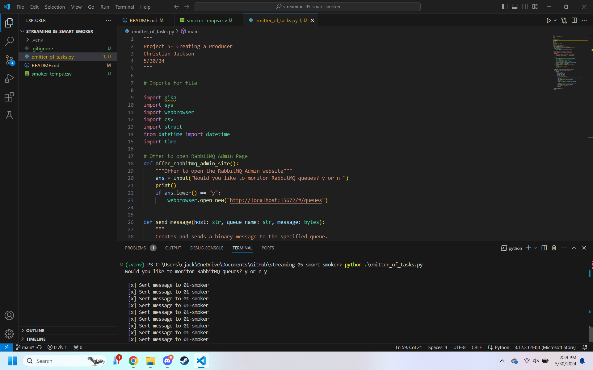

# streaming-05-smart-smoker

## The Problem / Challenge To Solve
Please read about the Smart Smoker system here: Smart Smoker
Access the smoker data file here Download smoker data file here.
We want to stream information from a smart smoker. Read one value every half minute. (sleep_secs = 30)

smoker-temps.csv has 4 columns:

[0] Time = Date-time stamp for the sensor reading
[1] Channel1 = Smoker Temp --> send to message queue "01-smoker"
[2] Channel2 = Food A Temp --> send to message queue "02-food-A"
[3] Channel3 = Food B Temp --> send to message queue "03-food-B"
Requirements

RabbitMQ server running
pika installed in your active environment
RabbitMQ Admin

See http://localhost:15672/Links to an external site.
General Design Questions

How many producers processes do you need to read the temperatures:
How many queues do we use: 
How many listening callback functions do we need (Hint: one per queue): 
If that is all you need to get started, you can begin the project now. Apply everything you've learned previously. 

## Task 1. Create a Place to Work
In GitHub, create a new repo for your project - name it streaming-05-smart-smoker
Add a README.md during the creation process. (If not, you can always add it later.)
Clone your repo down to your machine. 
In VS Code, add a .gitignore (use one from an earlier module), start working on the README.md. Create it if you didn't earlier.
Add the csv data file to your repo. 
Create a file for your bbq producer.

## Task 2. Design and Implement Your Producer
Implement your bbq producer. More detailed help provided in links below. 
Use the logic, approach, and structure from Module 4, version 2 and version 3.
These provide a current and solid foundation for streaming analytics - modifying them to serve your purpose IS part of the assignment.
Do not start from scratch - do not search for code - do not use a notebook.
Use comments in the code and repo to explain your work. 
Use docstring comments and add your name and date to your README and your code files. 
Explain your project in the README. Include prerequisites and how to run your code. 
Document your project works - display screenshots of your console and maybe the RabbitMQ console. 
If you only have a producer, you won't have a consumer showing messages yet, so you'll need to be creative. We'll build the consumers next.

## How to run code. 
1. Clone down the repo to your local machine.
2. Open it in whatever IDE that you prefer
3. Open a terminal within the repo folder
4. Activate the local environment using the command '.venv/Scripts/activate'
5. Once active, run the command 'python .\emitter_of_tasks.py'

## Screenshots

